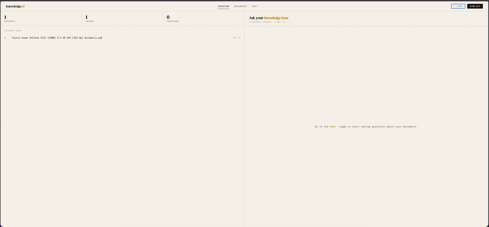
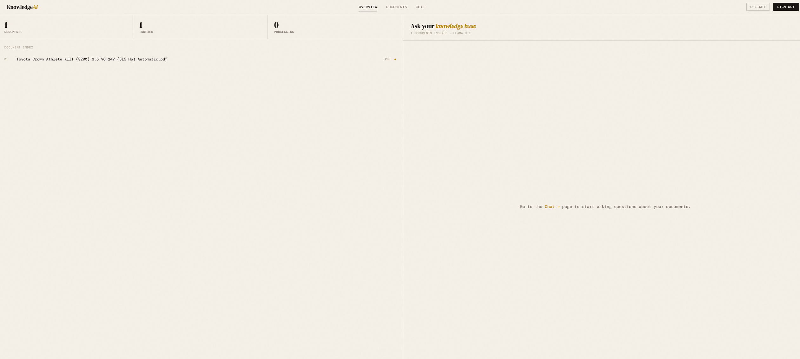

# KnowledgeAI

A full-stack Retrieval-Augmented Generation (RAG) SaaS built from scratch. Users upload documents (PDF, DOCX, TXT), and the system lets them chat with their content using a locally-running AI model — no data leaves the machine.

Built as a portfolio project to demonstrate production-style engineering across backend architecture, ML pipelines, and frontend design.

---

## Demo

> Upload a document → it gets processed in the background → ask questions → get streamed, cited answers from your own content.




---

## Architecture

```
React (Vite) Frontend
        │
        ▼
FastAPI Backend  (/api/v1)
        │
   ┌────┴─────────────────┐
   │                      │
PostgreSQL + pgvector    Ollama
(users, documents,      (Llama 3.2
 chunks, embeddings,     local LLM)
 conversations)
   │
Celery + Redis
(async document processing)
```

### Document Processing Pipeline
```
File upload
    → Celery picks up task
    → Extract text (pypdf / python-docx)
    → Split into 500-word overlapping chunks
    → Generate 384-dim embeddings (all-MiniLM-L6-v2)
    → Store vectors in pgvector
    → Mark document as indexed
```

### Chat Pipeline
```
User question
    → Embed question (same model)
    → pgvector cosine similarity search
    → Retrieve top-N relevant chunks
    → Check similarity threshold (>0.3)
    → Build prompt: system + chunks + conversation history
    → Stream Llama 3.2 response token by token (SSE)
    → Return citations alongside answer
    → Persist messages to database
```

---

## Tech Stack

| Layer | Technology | Why |
|-------|-----------|-----|
| Backend | FastAPI (Python 3.12) | Modern, async-ready, auto-generates API docs |
| Package management | uv | Faster than pip, reproducible lockfile |
| Database | PostgreSQL 16 + pgvector | Stores both relational data and vector embeddings in one place |
| Migrations | Alembic | Version-controlled schema changes |
| ORM | SQLAlchemy | Type-safe DB access, clean model definitions |
| Auth | JWT (python-jose) + bcrypt | Stateless auth, industry standard for APIs |
| Background tasks | Celery + Redis | Decouples slow processing from the request cycle |
| Embeddings | sentence-transformers (all-MiniLM-L6-v2) | Free, local, 384-dim vectors, no API cost |
| LLM | Llama 3.2 via Ollama | Runs fully locally, no data sent to third parties |
| Frontend | React + Vite | Fast dev experience, component-based |
| Containerization | Docker + Docker Compose | Reproducible environment, pgvector-enabled Postgres |

---

## Key Engineering Decisions

**Why Celery instead of FastAPI BackgroundTasks?**
BackgroundTasks runs in the same process as the API server — if the server restarts, tasks are lost. Celery persists tasks in Redis, retries on failure, and scales independently from the API.

**Why pgvector instead of a dedicated vector database (Pinecone, Weaviate)?**
Keeping vectors in PostgreSQL means one less infrastructure dependency, simpler deployment, and the ability to join vector search results with relational data (user, org, document) in a single query.

**Why local embeddings instead of OpenAI's API?**
No per-request cost, no data leaving the machine, no API key required. `all-MiniLM-L6-v2` is fast enough on CPU for a portfolio scale and produces quality embeddings for semantic search.

**Why a similarity threshold?**
Without one, the LLM receives low-relevance chunks and confidently hallucinates answers. A threshold of 0.3 means if no chunk is sufficiently similar to the question, the model is told explicitly that no relevant content was found.

**Why per-document conversations?**
Scoping each chat to one document prevents cross-document context pollution and gives users a clear mental model of what the AI knows in each conversation.

---

## Features

- JWT authentication with multi-tenant organization model
- Document upload with drag-and-drop (PDF, DOCX, TXT)
- Async background processing with real-time status updates
- Vector similarity search with cosine distance
- Streaming RAG chat with source citations
- Full conversation memory per session
- Persistent chat history per document
- Context summary handoff when approaching token limits
- Rate limiting on chat endpoint (10 req/min)
- Dark / light mode
- Docker Compose for one-command local setup

---

## Known Limitations & Planned Improvements

| Limitation | Impact | Planned Fix |
|-----------|--------|-------------|
| Word-count chunking | Tables and headers get split mid-structure | Semantic chunking at paragraph boundaries |
| No re-ranking | Top-N by cosine similarity ≠ top-N by relevance | Cross-encoder re-ranker as a second pass |
| Local file storage | Doesn't survive server migration | Swap `storage.py` for S3-backed implementation |
| Single Ollama instance | Concurrent chats queue up | Horizontal scaling with load balancer |
| No token blacklist | Stolen JWTs valid until expiry | Redis-backed token blacklist on logout |

---

## Running Locally

### Prerequisites
- Docker Desktop
- Ollama ([ollama.com](https://ollama.com))
- Node.js 18+

### 1. Clone the repo
```bash
git clone https://github.com/Baibhav10/KnowledgeAI.git
cd KnowledgeAI
```

### 2. Set up environment variables
```bash
cp backend/.env.example backend/.env
# Edit backend/.env and set JWT_SECRET to a random string:
# python3 -c "import secrets; print(secrets.token_urlsafe(64))"
```

### 3. Pull the LLM
```bash
ollama pull llama3.2
```

### 4. Start the backend stack
```bash
docker compose up --build
```

### 5. Run database migrations
```bash
cd backend
uv run alembic upgrade head
```

### 6. Start the Celery worker
```bash
cd backend
uv run celery -A app.worker.celery_app worker --loglevel=info --pool=solo
```

### 7. Start the frontend
```bash
cd frontend
npm install
npm run dev
```

### 8. Open the app
```
http://localhost:5173
```

---

## Project Structure

```
KnowledgeAI/
├── backend/
│   ├── app/
│   │   ├── api/v1/routes/     # auth, chat, documents, search, conversations
│   │   ├── core/              # config, database, logging, security, embedder, chunker, extractor
│   │   ├── models/            # SQLAlchemy ORM models
│   │   ├── schemas/           # Pydantic request/response schemas
│   │   └── worker/            # Celery app and tasks
│   ├── alembic/               # Database migrations
│   └── Dockerfile
├── frontend/
│   └── src/
│       ├── api/               # Axios client
│       ├── components/        # Layout
│       ├── context/           # Auth and theme context
│       └── pages/             # Login, Dashboard, Documents, Chat
└── docker-compose.yml
```

---

## API Documentation

With the backend running, visit:
```
http://localhost:8000/docs
```

Full interactive API documentation auto-generated by FastAPI.

---

## Author

Baibhav Shrestha
[github.com/Baibhav10](https://github.com/Baibhav10)